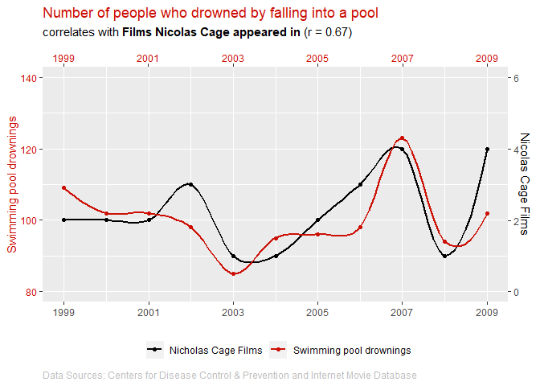
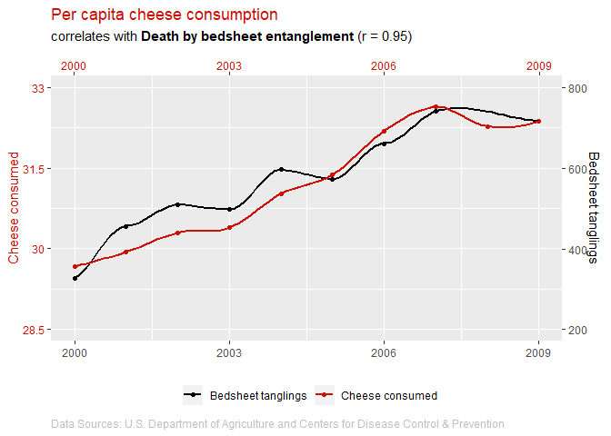
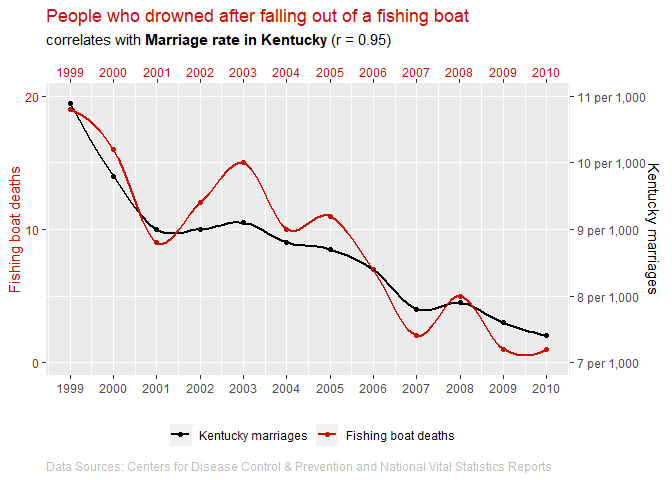

<!-- README.md is generated from README.Rmd. Please edit that file -->

# whysospurious 

<!-- badges: start -->

[](https://github.com/schuelkem/whysospurious)
[](https://github.com/schuelkem/whysospurious/commits/master)
<!-- badges: end -->

A package for illustrating the golden rule that “correlation does not
imply causation”.

## Installation

You can install the latest version of whysospurious from
[GitHub](https://github.com) with:

``` r
remotes::install_github("schuelkem/whysospurious")
```

## Example

The number of people who drowned by falling into a pool correlates with
films Nicolas Cage appeared in (r = 0.67).

``` r
library(whysospurious)
tylervigen_plot2()
```



## Another Example

Per capita cheese consumption correlates with Number of people who died
by becoming tangled in their bedsheets (r = 0.95).

``` r
tylervigen_plot3()
```



## Yet Another Example

People who drowned after falling out of a fishing boat correlates with
marriage rate in Kentucky (r = 0.95)

``` r
tylervigen_plot9()
```


